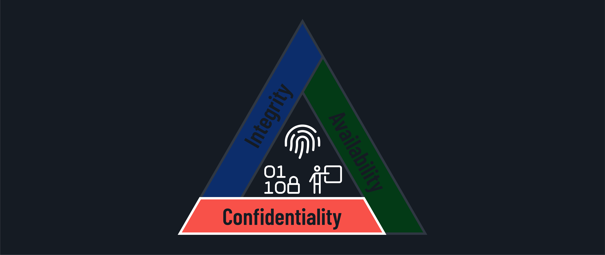
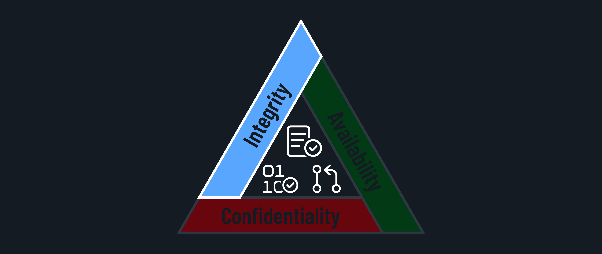
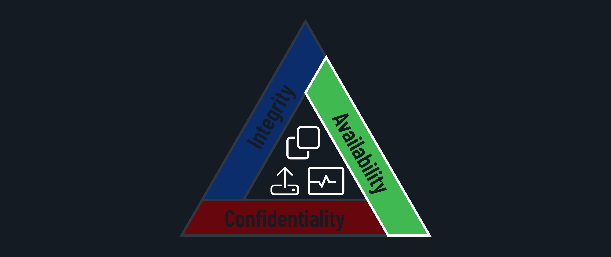

<h1>
  The CIA Triad
  Identifying and Protecting CIA
</h1>

**Learning objective:** By the end of this lesson, students will be able to identify the CIA triad in real-life scenarios.

## Real-world examples of the CIA triad

Now that we understand the components of the CIA triad let's analyze some real-world examples to see how they come into play.

### Scenario 1: Data breach at a healthcare provider

Imagine a healthcare provider experiencing a data breach where unauthorized individuals access patient records. This breach could occur due to a phishing attack or a vulnerability in the provider's systems.

- **Confidentiality**: Only authorized healthcare providers should have access to patient information. Unauthorized individuals obtaining access is a breach of confidentiality requirements.

- **Integrity**: Medical records must be accurate and unaltered. Depending on the level of access the unauthorized individuals obtain, they may be able to alter records.

- **Availability**: Critical information must be accessible during emergencies, which could be impacted if the unauthorized individuals also utilize ransomware.

### Scenario 2: Ransomware attack on a financial institution

Consider a ransomware attack on a financial institution where attackers encrypt critical data and demand a ransom. This type of attack can harm the institution's operations and customer trust, causing significant financial damage.

The attackers may also threaten to leak sensitive customer information if the ransom is not paid, further escalating the crisis.

- **Confidentiality**: Ransomware encryption prevents anyone from seeing the data. If the data had already been encrypted, the attackers wouldn't have been able to see the data, so this may not have caused a breach of confidentiality.

- **Integrity**: Your balance and account information must be accurate for integrity to be present. If the attack changes anything with the data or your account suddenly says $0.00 because of it, integrity is breached.

- **Availability**: You need access to your money 24/7. Unless there are controls in place and the bank has backups, this type of event will likely prevent you from accessing your money immediately. This negates the availability.

### Scenario 3: Website defacement

Suppose hackers deface a company's website by replacing the original content with malicious or misleading information. This primarily impacts the website's integrity, as the content is no longer accurate or trustworthy. It may also affect availability if the defacement renders the website inaccessible to users.

- **Confidentiality**: If there was anything confidential on the website, it may have been impacted during the attack.

- **Integrity**: Since the content is no longer accurate or trustworthy, this attack mainly affects the website's integrity.

- **Availability**: Availability would be impacted if the defacement renders the website inaccessible to users.

## Protecting CIA: Practical strategies

Organizations can implement various practical measures in their IT environments to safeguard the CIA triad. Let's explore some strategies for each aspect.

### Protecting confidentiality

- Implement strong access controls and authentication mechanisms to ensure only authorized users can access sensitive data.

- Use encryption techniques to protect data at rest and in transit, making it unreadable to unauthorized parties.

- Regular security awareness training should be conducted for employees to educate them on handling sensitive information securely.

### Protecting integrity

- Implement data validation and input sanitization techniques to prevent unauthorized modifications to data.

- Use digital signatures and hashing algorithms to verify the authenticity and integrity of data.

- Establish version control and change management processes to track and audit modifications to critical data.

### Protecting availability

- Implement redundancy and failover mechanisms to ensure continuous availability of critical systems and data.

- Conduct regular backup and disaster recovery testing to minimize downtime in the event of a disruption.

- Monitor system performance and capacity to identify and address potential availability issues proactively.

  <h2 class="title">Evaluate a lost device incident</h2>
  10 min

You'll work with a partner for this exercise. Evaluate the scenario, then follow the instructions to assess the impact. We'll regroup as a class and discuss your findings.

**Scenario**: An employee misplaces a company-issued laptop that contains sensitive internal emails and documents.

**Instructions**: Assess the impact of this incident on the CIA triad. Consider the following questions:

Confidentiality:

- How does the loss of the laptop put sensitive company information at risk?
- What might unauthorized individuals do if they get access to this data?

Integrity:

- Could the data on the laptop be tampered with if it falls into the wrong hands?
- What would be the impact if the information were altered?

Availability:

- How might the loss affect the employee's ability to access necessary information for work?
- What could be the consequences for overall business operations?

Finally, consider the following questions:

- What security measures could prevent or mitigate this incident?
- Consider if any measures reinforce more than one aspect of the CIA triad to create a comprehensive security strategy.
